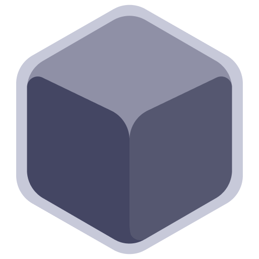
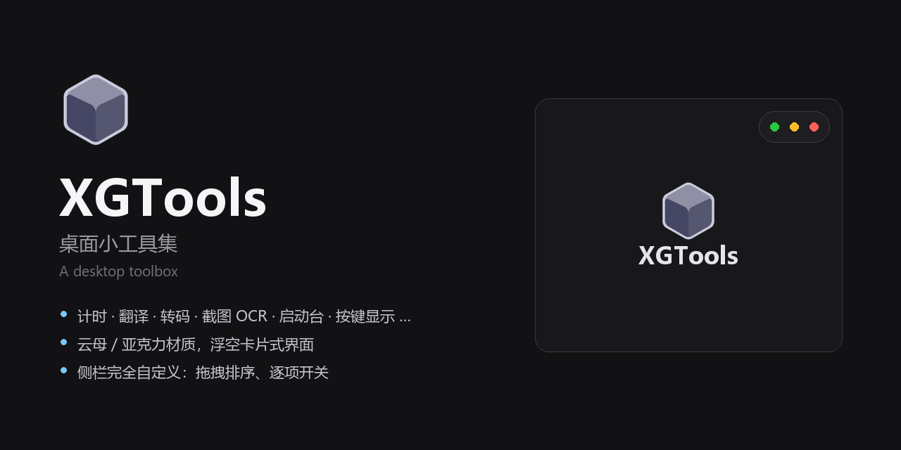
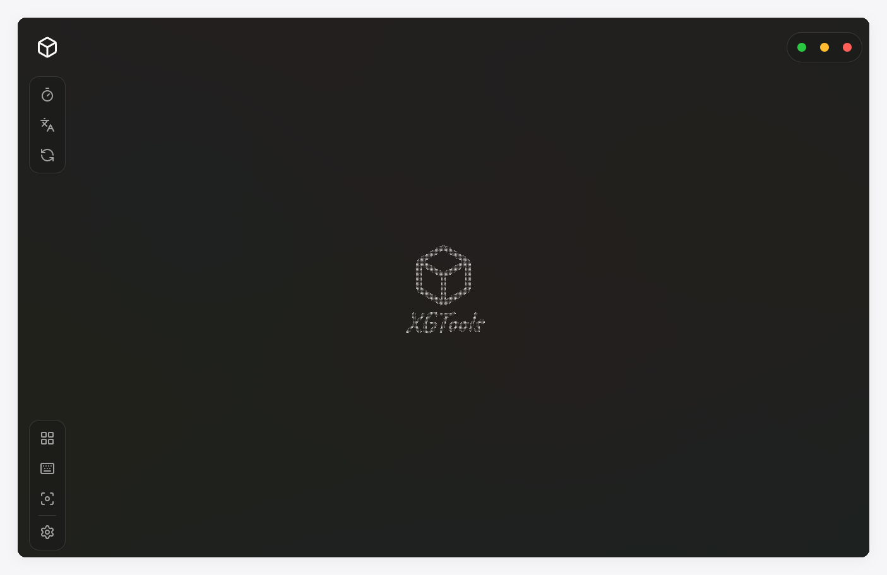
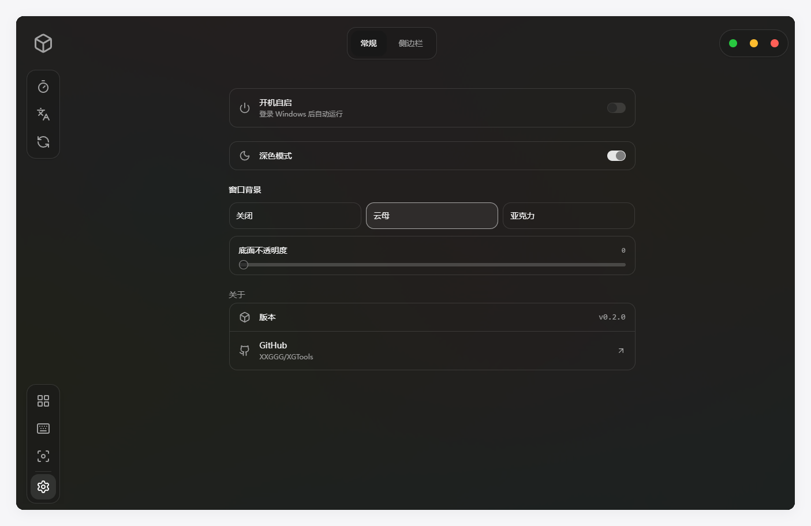
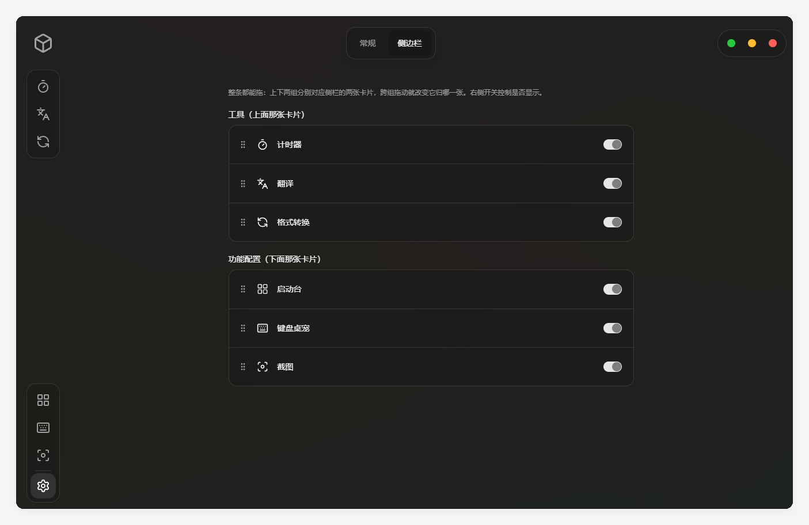

English | [官话 - 简体中文](README-cmn_CN.md) | [官話 - 繁體中文](README-cmn_TW.md) | [廣東話](README-jyut.md)

<br>

<p align='center'>
  
</p>

<h1 align='center'>XGTools</h1>

<p align='center'>
  <samp>A desktop toolbox — the small utilities you reach for daily, behind one icon</samp>
</p>

<p align='center'>
  
  
  
  
  
  
</p>

<p align='center'>
  <a href="https://github.com/XXGGG/XGTools/releases">Download</a>
</p>

<br>

## 👋 Introduction

XGTools puts the small utilities you reach for every day — a timer, a translator, a file
converter, a screenshot tool with OCR, an app launcher, a key-press overlay — behind a
single icon in the tray, instead of a separate program per task — each with its own
updater, its own tray icon and its own idea of what a settings window should look like.

It is a personal tool, built for one Windows machine and shared as-is.

> [!IMPORTANT]
> **v0.2.0 — everything listed below works, with one exception.** The *Keyboard Pet*
> page currently only ships the key-press overlay; the pet itself is not built yet.

<div align="center">
  
</div>

<div align="center">
  
</div>

## ✨ What makes it different

**The chrome floats, so content is centred against the whole window.** The sidebar and
the title bar are overlays, not layout. A conventional app centres its content in
"whatever is left after the sidebar and title bar", which pushes anything centred down
and to the right by half the chrome. Here the content layer spans the entire window and
the chrome sits on top of it, so centred things are genuinely centred.

**One alignment constant instead of hand-tuned offsets.** The logo, the sidebar icon
column and the window controls all derive from a single 72px column. Change that number
and all three move together — there is no separate nudge for each.

**Window materials are composed in CSS, not handed to the OS.** On Windows 11 build
22523 and later, the acrylic and mica APIs ignore the tint colour you pass them, so the
system only contributes the blur. Everything else — the base surface, the cards, the
borders, the shadows — is layered in CSS, which is why the opacity slider actually moves
something and why borders adapt instead of staying a hard white line.

**Every tool page can be turned off.** The sidebar is user-defined: drag to reorder, drag
across groups to change which card an entry belongs to, toggle any page off. Turn all of
them off and the card disappears entirely — the settings entry is always there, so you
can never lock yourself out.

<div align="center">
  
</div>

## 🚀 Getting started

Grab the installer from [Releases](https://github.com/XXGGG/XGTools/releases), or build
it yourself:

```bash
pnpm install

# Format conversion needs ffmpeg — drop ffmpeg.exe and ffprobe.exe into
# src-tauri/resources/ffmpeg/  (https://github.com/BtbN/FFmpeg-Builds/releases)

pnpm tauri dev      # development
pnpm tauri build    # installer -> src-tauri/target/release/bundle/nsis/
```

Requirements: Node.js 18+, Rust 1.77+, pnpm, and Windows 10/11 — several features call
Win32 APIs directly and have no cross-platform path.

## 📦 What's inside

| | |
|---|---|
| **Timer** | Cube timer driven by the spacebar, plus a pomodoro clock that keeps running when you switch pages |
| **Translate** | Google / Bing / DeepL, plus OpenAI-compatible endpoints (OpenAI, DeepSeek, Claude, Gemini, Groq). Reads results aloud |
| **Convert** | Images, audio and video via a bundled ffmpeg; extracts audio tracks from video |
| **Launcher** | Full-screen app grid with drag-to-reorder, pages, and icons pulled straight out of the executables |
| **Screenshot** | Region capture, annotation, window snapping, pin-to-screen, OCR (PaddleOCR) and translate-in-place |
| **Keyboard** | Global key-press overlay that lays itself out, dodges the cursor and clears itself after a delay you choose |

<div align="center">
  
</div>

## 📁 Layout

```
src/
  App.vue                    window routing + the floating chrome
  components/TitleBar.vue    logo, teleport target for page tabs, window controls
  components/ParticleLogo.vue  canvas particle logo (samples an offscreen render)
  composables/               shared reactive settings, persisted to settings.json
  lib/sidebar-prefs.ts       sidebar order/visibility reconciliation (pure, testable)
  views/                     one file per tool page
src-tauri/src/
  window_effects.rs          mica / acrylic, and the dark-mode attribute Windows needs
  *_commands.rs              screenshot, OCR, translate, convert, launcher, window detect
```

## 🙏 Credits

**Frameworks** — [Tauri](https://tauri.app), [Vue.js](https://vuejs.org),
[Tailwind CSS](https://tailwindcss.com)
**UI** — [shadcn-vue](https://www.shadcn-vue.com) (on [reka-ui](https://reka-ui.com)),
[Lucide](https://lucide.dev) icons
**Capture & OCR** — [xcap](https://github.com/nashaofu/xcap),
[PaddleOCR](https://github.com/PaddlePaddle/PaddleOCR),
[ONNX Runtime](https://onnxruntime.ai)
**Input & effects** — [rdev](https://github.com/Narsil/rdev),
[window-vibrancy](https://github.com/tauri-apps/window-vibrancy)

The particle logo takes its *idea* from the interaction on
[nuxtlabs.com](https://nuxtlabs.com) — the implementation here is written from scratch
and shares no code with it.

README layout follows [vitesse](https://github.com/antfu-collective/vitesse) and
[BewlyBewly](https://github.com/BewlyBewly/BewlyBewly).

## License

[CC BY-NC-SA 4.0](https://creativecommons.org/licenses/by-nc-sa/4.0/) — free to use,
modify and share, with attribution, **non-commercial**, and derivatives under the same
licence.

Copyright © 2026 [Xie Xiage](https://github.com/XXGGG)
